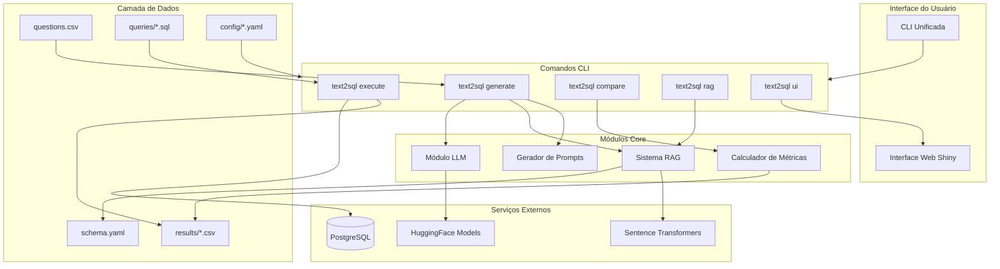
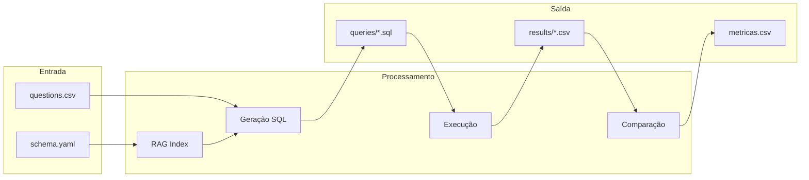
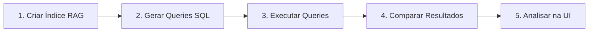
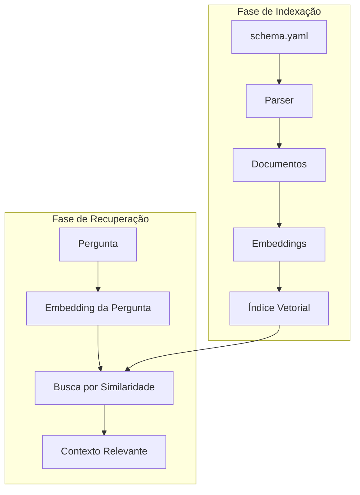

# Text2SQL Application

Sistema inteligente para conversão de perguntas em linguagem natural para consultas SQL, utilizando modelos de linguagem (LLMs) com suporte a RAG (Retrieval-Augmented Generation).

## Índice

- [Visão Geral](#visão-geral)
- [Como Funciona - Explicação para Leigos](#como-funciona---explicação-para-leigos)
- [Arquitetura do Sistema](#arquitetura-do-sistema)
- [Estrutura de Diretórios](#estrutura-de-diretórios)
- [Instalação e Configuração](#instalação-e-configuração)
- [CLI - Comandos Disponíveis](#cli---comandos-disponíveis)
- [Fluxo de Trabalho Típico](#fluxo-de-trabalho-típico)
- [Configurações YAML](#configurações-yaml)
- [Sistema RAG](#sistema-rag-detalhes-técnicos)
- [Métricas de Avaliação](#métricas-de-avaliação)
- [Interface Web](#interface-web-shiny)

---

## Visão Geral

O **Text2SQL Application** é uma aplicação completa que permite transformar perguntas escritas em português em consultas SQL executáveis. O sistema foi desenvolvido para facilitar o acesso a dados armazenados em bancos de dados PostgreSQL sem a necessidade de conhecimento técnico em SQL.

### Principais Funcionalidades

- **Geração automática de SQL**: Converte perguntas em linguagem natural para consultas SQL precisas
- **Sistema RAG**: Recupera contexto relevante do schema do banco de dados para melhorar a qualidade das queries
- **Execução de queries**: Executa as consultas geradas diretamente no banco PostgreSQL
- **Avaliação de qualidade**: Compara resultados com ground truth e calcula métricas de precisão
- **Interface web**: Dashboard interativo para análise e comparação de resultados
- **CLI unificada**: Linha de comando completa para todas as operações

### Stack Tecnológico

| Componente | Tecnologia |
|------------|------------|
| Linguagem | Python 3.12+ |
| Interface Web | Shiny for Python |
| Modelos LLM | Transformers (HuggingFace) |
| Embeddings | Sentence-Transformers (BERTimbau) |
| Banco de Dados | PostgreSQL |
| CLI | Typer |
| Dados | Pandas, NumPy |

---

## Como Funciona - Explicação para Leigos

Esta seção explica a estratégia do projeto de forma acessível, usando analogias e linguagem simples.

### O Problema

Imagine que você trabalha em um hospital e precisa saber quais medicamentos estão com estoque baixo. A informação existe no sistema, mas para obtê-la você precisaria:

1. Conhecer a linguagem SQL (usada para "conversar" com bancos de dados)
2. Saber exatamente onde os dados estão armazenados (quais tabelas e colunas)
3. Escrever uma consulta técnica correta

**Isso cria uma barreira**: apenas pessoas com conhecimento técnico conseguem extrair informações do banco de dados.

### A Solução

O Text2SQL funciona como um **tradutor inteligente** que entende português e "fala" a linguagem do banco de dados (SQL). Mas diferente de um tradutor comum, ele precisa conhecer a estrutura do banco para traduzir corretamente.

### Os 3 Pilares da Estratégia

```
┌─────────────────────────────────────────────────────────────────────────┐
│                        ESTRATÉGIA TEXT2SQL                              │
├─────────────────┬─────────────────────┬─────────────────────────────────┤
│   1. CONHECER   │    2. TRADUZIR      │        3. VALIDAR               │
│    (RAG)        │      (LLM)          │       (Métricas)                │
├─────────────────┼─────────────────────┼─────────────────────────────────┤
│ Estudar o banco │ Entender a pergunta │ Comparar com respostas corretas │
│ Indexar tabelas │ Gerar SQL preciso   │ Medir qualidade                 │
│ Buscar contexto │ Usar o contexto     │ Identificar melhorias           │
└─────────────────┴─────────────────────┴─────────────────────────────────┘
```

#### Pilar 1: Conhecimento do Banco (RAG - Recuperação de Contexto)

Antes de traduzir qualquer pergunta, o sistema "estuda" o banco de dados:

- **Cria um índice inteligente** com todas as tabelas, colunas e relacionamentos
- **Quando recebe uma pergunta**, busca apenas as informações relevantes para aquela consulta específica
- **Analogia**: Funciona como um bibliotecário experiente que sabe exatamente onde encontrar cada livro. Você pergunta sobre "medicamentos em falta" e ele já sabe que precisa olhar nas prateleiras de "estoque" e "produtos"

#### Pilar 2: O Tradutor (Modelo de Linguagem - LLM)

Com o contexto em mãos, entra em ação a inteligência artificial:

- **Recebe a pergunta** em português junto com as informações relevantes do banco
- **Entende a intenção** do usuário (listar dados, contar, somar, etc.)
- **Gera a consulta SQL** correspondente
- **Analogia**: É como um especialista em SQL que recebe um briefing completo sobre o banco e escreve a consulta perfeita

#### Pilar 3: Validação e Qualidade (Métricas de Avaliação)

Para garantir que o sistema funciona bem:

- **Compara as respostas geradas** com respostas corretas conhecidas (ground truth)
- **Calcula métricas** como precisão, cobertura e acurácia
- **Identifica onde o sistema acerta e onde precisa melhorar**
- **Analogia**: Como um professor que corrige provas e dá feedback sobre os erros

### Fluxo Simplificado

```
    ╔══════════════════════════════════╗
    ║   "Quais medicamentos estão      ║
    ║    com estoque crítico?"         ║
    ╚════════════════╦═════════════════╝
                     │
                     ▼
    ┌────────────────────────────────────┐
    │  🔍 RAG busca contexto relevante   │
    │  → Tabela: estoque                 │
    │  → Tabela: cadastro_mat_med        │
    │  → Relacionamentos entre elas      │
    └────────────────┬───────────────────┘
                     │
                     ▼
    ┌────────────────────────────────────┐
    │  🤖 LLM gera a consulta SQL        │
    │  SELECT cd_material, ds_material   │
    │  FROM estoque e                    │
    │  JOIN cadastro_mat_med c ON ...    │
    │  WHERE cobertura_dias <= 15        │
    └────────────────┬───────────────────┘
                     │
                     ▼
    ┌────────────────────────────────────┐
    │  💾 Executa no banco PostgreSQL    │
    └────────────────┬───────────────────┘
                     │
                     ▼
    ╔══════════════════════════════════╗
    ║  📊 Lista de medicamentos com    ║
    ║     estoque abaixo de 15 dias    ║
    ╚══════════════════════════════════╝
```

### Exemplo Prático Completo

| Etapa | O que acontece | Exemplo |
|-------|----------------|---------|
| **Pergunta** | Usuário faz pergunta em português | "Quais medicamentos estão com estoque crítico?" |
| **Contexto RAG** | Sistema identifica tabelas relevantes | `estoque`, `cadastro_mat_med`, `movimento_estoque` |
| **Geração SQL** | IA cria a consulta apropriada | `SELECT cd_material, ds_material FROM estoque WHERE cobertura <= 15` |
| **Execução** | Query é executada no banco | Conexão PostgreSQL → Execução → Resultado |
| **Resultado** | Dados retornados ao usuário | Lista com 23 medicamentos em situação crítica |
| **Validação** | Comparação com resposta esperada | Precisão: 95%, Recall: 100% |

### Por que essa abordagem funciona?

1. **Contexto específico**: O RAG garante que o LLM receba apenas informações relevantes, evitando confusão
2. **Conhecimento atualizado**: O índice do schema reflete a estrutura real do banco
3. **Qualidade mensurável**: As métricas permitem identificar e corrigir problemas
4. **Escalabilidade**: Funciona com qualquer banco de dados PostgreSQL

---

## Arquitetura do Sistema



### Fluxo de Dados



---

## Estrutura de Diretórios

```
text2sql_application/
├── app/                          # Código fonte principal
│   ├── cli/                      # Comandos da CLI
│   │   ├── main.py              # CLI unificada
│   │   ├── generate_queries/    # Comando de geração
│   │   ├── execute_sql/         # Comando de execução
│   │   ├── compare/             # Comando de comparação
│   │   ├── rag_index/           # Comando do RAG
│   │   └── ground_truth/        # Comando de ground truth
│   ├── llm/                      # Módulo de LLM
│   │   ├── rag/                 # Sistema RAG
│   │   │   ├── schema_indexer.py    # Indexador do schema
│   │   │   ├── retriever.py         # Recuperador de contexto
│   │   │   └── text2sql_rag.py      # Orquestrador RAG
│   │   ├── model/               # Wrappers de modelos
│   │   ├── prompt/              # Geradores de prompt
│   │   └── evaluate/            # Avaliação de modelos
│   ├── metrics/                  # Cálculo de métricas
│   │   ├── calculator.py        # Funções de cálculo
│   │   └── comparator.py        # Comparação de resultados
│   ├── ui/                       # Interface Shiny
│   │   ├── layouts.py           # Layouts da UI
│   │   └── components.py        # Componentes visuais
│   ├── config/                   # Configurações da app
│   │   └── paths.py             # Caminhos padrão
│   ├── data/                     # Carregadores de dados
│   └── main.py                   # Ponto de entrada Shiny
│
├── config/                       # Arquivos de configuração YAML
│   ├── generate_config.yaml     # Config de geração
│   ├── execute_config.yaml      # Config de execução
│   ├── compare_config.yaml      # Config de comparação
│   └── rag_index_config.yaml    # Config do RAG
│
├── data/                         # Dados da aplicação
│   ├── questions.csv            # Perguntas de entrada
│   ├── schema.yaml              # Schema do banco de dados
│   ├── queries/                 # Queries SQL geradas
│   │   ├── ground_truth/        # Queries corretas (referência)
│   │   └── <modelo>/            # Queries por modelo
│   └── results/                 # Resultados das execuções
│       ├── ground_truth/        # Resultados de referência
│       └── <modelo>/            # Resultados por modelo
│
├── notebooks/                    # Jupyter notebooks
├── pyproject.toml               # Configuração do projeto
└── README.md                    # Esta documentação
```

---

## Instalação e Configuração

### Requisitos do Sistema

- Python 3.12 ou superior
- PostgreSQL (banco de dados alvo)
- GPU recomendada para geração com LLMs (opcional, mas melhora performance)

### Instalação

#### Usando uv (recomendado)

```bash
# Clonar o repositório
git clone <url-do-repositorio>
cd text2sql_application

# Instalar dependências com uv
uv sync

# Instalar o pacote em modo editável
uv pip install -e .
```

#### Usando pip

```bash
# Clonar o repositório
git clone <url-do-repositorio>
cd text2sql_application

# Criar ambiente virtual
python -m venv .venv
source .venv/bin/activate  # Linux/Mac
# ou .venv\Scripts\activate  # Windows

# Instalar dependências
pip install -e .
```

### Configuração do Banco de Dados

Crie um arquivo `.env` na raiz do projeto com as credenciais do banco:

```env
# Configuração do PostgreSQL
DB_HOST=localhost
DB_PORT=5432
DB_NAME=seu_banco
DB_USER=seu_usuario
DB_PASSWORD=sua_senha

# Token do HuggingFace (opcional, para modelos privados)
HF_TOKEN=seu_token_huggingface
```

### Verificar Instalação

```bash
# Testar se a CLI está funcionando
text2sql --help

# Testar conexão com o banco de dados
text2sql execute test-db
```

---

## CLI - Comandos Disponíveis

A aplicação oferece uma CLI unificada com todos os comandos necessários para o pipeline Text2SQL.

### Visão Geral dos Comandos

```bash
text2sql --help
```

| Comando | Descrição |
|---------|-----------|
| `text2sql generate` | Gera queries SQL a partir de perguntas em linguagem natural |
| `text2sql execute` | Executa queries SQL no banco de dados PostgreSQL |
| `text2sql compare` | Compara resultados de modelos com o ground truth |
| `text2sql rag` | Gerencia o índice RAG do schema |
| `text2sql ground-truth` | Gera ground truth parametrizado |
| `text2sql ui` | Inicia a interface web Shiny |

### Comando: generate

Gera queries SQL a partir de perguntas usando LLM com RAG.

```bash
# Usando configuração padrão
text2sql generate run

# Com arquivo de configuração específico
text2sql generate run --config config/generate_config.yaml

# Especificando modelo e run
text2sql generate run --model "Qwen/Qwen3-32B-AWQ" --run "experimento1"
```

**Opções principais:**
- `--config, -c`: Arquivo YAML de configuração
- `--model, -m`: Nome do modelo LLM a usar
- `--run, -r`: Nome da execução (para organização dos resultados)
- `--questions, -q`: Caminho para arquivo CSV de perguntas

### Comando: execute

Executa queries SQL geradas no banco de dados.

```bash
# Executar queries com configuração padrão
text2sql execute run

# Especificar diretórios
text2sql execute run --queries data/queries/Qwen3-32B-AWQ/default --results data/results/Qwen3-32B-AWQ/default

# Testar conexão com o banco
text2sql execute test-db

# Sem modo resume (reexecuta todas as queries)
text2sql execute run --no-resume
```

**Opções principais:**
- `--config, -c`: Arquivo YAML de configuração
- `--queries, -q`: Diretório com arquivos .sql
- `--results, -r`: Diretório para salvar resultados
- `--target-date`: Data para substituir CURRENT_DATE
- `--resume/--no-resume`: Continuar de onde parou ou reexecutar tudo

### Comando: compare

Compara resultados de um modelo com o ground truth.

```bash
# Comparar usando configuração YAML
text2sql compare compare --config config/compare_config.yaml

# Especificar pares de comparação
text2sql compare compare --gt default --model Qwen3-32B-AWQ/default

# Listar pares disponíveis para comparação
text2sql compare list-pairs
```

**Opções principais:**
- `--gt`: Run do ground truth (ex: "default")
- `--model, -m`: Modelo e run no formato "modelo/run"
- `--questions, -q`: Arquivo CSV de perguntas
- `--results-dir, -r`: Diretório com resultados

### Comando: rag

Gerencia o índice RAG do schema do banco de dados.

```bash
# Criar/atualizar índice RAG
text2sql rag run

# Forçar reconstrução do índice
text2sql rag run --force

# Testar o retriever com uma pergunta
text2sql rag test "Quais medicamentos estão com estoque crítico?"

# Ajustar threshold de similaridade
text2sql rag test "pergunta" --threshold 0.4
```

**Opções principais:**
- `--schema, -s`: Caminho para arquivo YAML do schema
- `--model, -m`: Modelo de embeddings (padrão: BERTimbau)
- `--cache-dir`: Diretório para cache dos embeddings
- `--force/-f`: Forçar reconstrução do índice

### Comando: ui

Inicia a interface web Shiny para visualização de resultados.

```bash
# Iniciar UI na porta padrão (8000)
text2sql ui

# Especificar porta e host
text2sql ui --port 8080 --host 0.0.0.0

# Com hot-reload para desenvolvimento
text2sql ui --reload
```

**Opções principais:**
- `--port`: Porta para a aplicação (padrão: 8000)
- `--host`: Host para bind (padrão: 127.0.0.1)
- `--reload`: Habilita recarregamento automático

---

## Fluxo de Trabalho Típico

O pipeline completo do Text2SQL segue estas etapas:



### Passo 1: Criar o Índice RAG

Antes de gerar queries, é necessário indexar o schema do banco:

```bash
# Criar índice RAG
text2sql rag run

# Verificar se o índice funciona
text2sql rag test "Quais itens estão com estoque baixo?"
```

### Passo 2: Gerar Queries SQL

Com o índice pronto, gerar as queries a partir das perguntas:

```bash
# Gerar queries usando o modelo configurado
text2sql generate run --config config/generate_config.yaml
```

As queries serão salvas em `data/queries/<modelo>/<run>/`.

### Passo 3: Executar as Queries

Executar as queries geradas no banco de dados:

```bash
# Executar todas as queries
text2sql execute run --config config/execute_config.yaml
```

Os resultados serão salvos em `data/results/<modelo>/<run>/`.

### Passo 4: Comparar com Ground Truth

Comparar os resultados com as respostas corretas:

```bash
# Comparar resultados
text2sql compare compare --gt default --model Qwen3-32B-AWQ/default
```

Serão gerados arquivos `metricas.csv` e `resumo.csv` com as métricas de avaliação.

### Passo 5: Analisar na Interface Web

Visualizar os resultados de forma interativa:

```bash
# Iniciar a interface web
text2sql ui
```

Acesse `http://localhost:8000` no navegador.

---

## Configurações YAML

Os arquivos de configuração permitem personalizar o comportamento de cada comando.

### generate_config.yaml

Configuração principal para geração de queries SQL.

```yaml
# Configuração do modelo LLM
model:
  name: "Qwen/Qwen3-32B-AWQ"      # Modelo do HuggingFace
  max_new_tokens: 32768            # Máximo de tokens na resposta
  temperature: 0.0001              # Baixa para respostas determinísticas
  top_p: 0.95
  enable_thinking: true            # Habilita modo de raciocínio

# Configuração do RAG
rag:
  model_name: "neuralmind/bert-large-portuguese-cased"  # BERTimbau
  similarity_threshold: 0.3        # Threshold mínimo de similaridade
  max_tables: 5                    # Máximo de tabelas no contexto
  max_columns_per_table: 20        # Máximo de colunas por tabela

# Caminhos dos arquivos
paths:
  questions: "data/questions.csv"
  schema: "data/schema.yaml"

# Configuração de saída
output:
  run: "default"
  save_queries: true
  queries_dir: "data/queries"

# Templates de prompt
templates:
  system: |
    Você é um conversor de linguagem natural para SQL.
    Contexto do Banco de Dados:
    {context}
    
    Regras de negócio:
    {business_rules}
    
    Diretrizes:
    - Use JOINs explícitos
    - Considere valores NULL
    - Use aliases para tabelas
    
  business_rules: |
    ## Estoque crítico:
    Cobertura igual ou menor que 15 dias.
```

### execute_config.yaml

Configuração para execução de queries.

```yaml
# Caminhos dos diretórios
paths:
  queries: "data/queries/Qwen3-32B-AWQ/default"
  results: "data/results/Qwen3-32B-AWQ/default"

# Configurações SQL
sql:
  target_date: "2024-07-19"  # Data para substituir CURRENT_DATE

# Banco de dados (sobrescrito por variáveis de ambiente)
database:
  host: "localhost"
  port: "5432"
  name: "text2sql"
  user: "usuario"
  password: "senha"
```

### compare_config.yaml

Configuração para comparação de resultados.

```yaml
# Caminhos
paths:
  questions: "data/questions.csv"
  results_dir: "data/results"

# Pares de comparação
comparison:
  gt_run: "default"                      # Ground truth
  model_run: "Qwen3-32B-AWQ/default"     # Modelo a comparar
```

### rag_index_config.yaml

Configuração do sistema RAG.

```yaml
# Caminhos
paths:
  schema: "data/schema.yaml"
  cache_dir: ".cache/embeddings"

# Configuração do RAG
rag:
  model_name: "neuralmind/bert-large-portuguese-cased"
  similarity_threshold: 0.3
  force_rebuild: false
```

---

## Sistema RAG (Detalhes Técnicos)

O RAG (Retrieval-Augmented Generation) é o coração do sistema, responsável por fornecer contexto relevante ao LLM.

### Como Funciona



### Componentes

#### SchemaIndexer

Responsável por indexar o schema do banco de dados:

- **Entrada**: Arquivo `schema.yaml` com descrição de tabelas, colunas e relacionamentos
- **Processamento**: Cria documentos textuais para cada elemento do schema
- **Saída**: Embeddings vetoriais usando BERTimbau (sentence-transformers)

#### SchemaRetriever

Responsável por recuperar contexto relevante:

- **Entrada**: Pergunta em linguagem natural
- **Processamento**: Busca por similaridade coseno nos embeddings
- **Saída**: Tabelas, colunas e relacionamentos mais relevantes

### Tipos de Documentos Indexados

| Tipo | Exemplo |
|------|---------|
| Tabela | "Tabela cadastro_mat_med: Catálogo central de materiais" |
| Coluna | "Tabela estoque, Coluna qt_disponivel, Tipo: numeric" |
| Chave Primária | "Chave primária da tabela estoque: cd_estoque" |
| Chave Estrangeira | "FK em estoque(cd_material) referencia cadastro_mat_med(cd_material)" |
| Índice | "Índice idx_estoque_material na tabela estoque: cd_material" |

### Modelo de Embeddings

O sistema usa o **BERTimbau** (`neuralmind/bert-large-portuguese-cased`), um modelo BERT treinado especificamente para português brasileiro.

**Por que BERTimbau?**
- Otimizado para português
- Entende nuances do idioma
- Melhor performance que modelos multilíngue genéricos

### Cache de Embeddings

Os embeddings são cacheados em `.cache/embeddings/` para evitar reprocessamento:

```
.cache/embeddings/
└── schema_embeddings_v2.pkl
```

Para forçar reconstrução:
```bash
text2sql rag run --force
```

---

## Métricas de Avaliação

O sistema calcula métricas diferentes dependendo do tipo de pergunta.

### Tipos de Perguntas

| Tipo | Descrição | Exemplo |
|------|-----------|---------|
| **Listagem** | Retorna múltiplos registros | "Quais medicamentos estão em falta?" |
| **Quantidade** | Retorna um valor numérico | "Quantas unidades do item X existem?" |

### Métricas para Perguntas de Listagem

Para perguntas que retornam listas de itens, são calculadas:

#### Precision (Precisão)

Mede a proporção de itens retornados que estão corretos.

```
Precision = Itens Corretos Retornados / Total de Itens Retornados
```

**Exemplo**: Se o modelo retornou 10 medicamentos e 8 estão corretos → Precision = 0.80

#### Recall (Cobertura)

Mede a proporção de itens corretos que foram encontrados.

```
Recall = Itens Corretos Retornados / Total de Itens Esperados
```

**Exemplo**: Se existem 12 medicamentos corretos e o modelo retornou 8 → Recall = 0.67

#### Accuracy (Acurácia)

Mede a qualidade geral considerando falsos positivos.

```
Accuracy = Itens Corretos / (Itens Esperados + Falsos Positivos)
```

#### F1-Score

Média harmônica entre Precision e Recall.

```
F1 = 2 × (Precision × Recall) / (Precision + Recall)
```

**Interpretação**: Um F1 alto indica bom equilíbrio entre precisão e cobertura.

### Métricas para Perguntas de Quantidade

Para perguntas que retornam valores numéricos:

#### Match (Correspondência)

Verifica se o valor retornado é exatamente igual ao esperado.

```
Match = 1.0 (correto) ou 0.0 (incorreto)
```

O sistema busca o valor esperado em qualquer coluna do resultado, permitindo flexibilidade nos nomes de colunas.

### Relatórios Gerados

Após a comparação, são gerados dois arquivos:

**metricas.csv** - Métricas por pergunta:
| id | questao | tipo | precision | recall | f1 | match |
|----|---------|------|-----------|--------|-----|-------|
| 1 | Quais itens... | listagem | 0.95 | 0.88 | 0.91 | - |
| 4 | Quantas unidades... | quantidade | 1.0 | 1.0 | 1.0 | True |

**resumo.csv** - Métricas agregadas:
| metrica | valor |
|---------|-------|
| precision_media | 0.89 |
| recall_media | 0.85 |
| f1_media | 0.87 |
| taxa_execucao_sucesso | 0.95 |

---

## Interface Web (Shiny)

A interface web permite visualizar e analisar os resultados de forma interativa.

### Iniciando a Interface

```bash
text2sql ui
```

Acesse: http://localhost:8000

### Funcionalidades

#### Dashboard Principal

- **Métricas agregadas**: Visão geral de precision, recall, F1 e taxa de sucesso
- **Gráficos comparativos**: Visualização das métricas por modelo
- **Seletor de pares**: Escolha qual modelo comparar com qual ground truth

#### Visualização por Pergunta

- **Lista de perguntas**: Todas as perguntas do dataset
- **Detalhes por pergunta**: SQL gerado, SQL esperado, métricas individuais
- **Comparação de resultados**: Visualização lado a lado dos dados retornados

#### Análise de Erros

- **Queries com erro**: Lista de queries que falharam na execução
- **Mensagens de erro**: Detalhes do erro SQL
- **Sugestões**: Identificação de padrões de erro comuns

### Selecionando Pares de Comparação

Na sidebar da interface, você pode selecionar:

1. **Ground Truth Run**: A execução de referência (ex: "default")
2. **Modelo/Run**: O modelo e execução a comparar (ex: "Qwen3-32B-AWQ/default")

Os dados são atualizados automaticamente ao trocar a seleção.

---

## Contribuindo

### Estrutura de Commits

```
feat: adiciona nova funcionalidade
fix: corrige bug
docs: atualiza documentação
refactor: refatora código sem mudar funcionalidade
test: adiciona ou modifica testes
```

### Executando Testes

```bash
# Executar todos os testes
pytest

# Com cobertura
pytest --cov=app
```

---

## Licença

Este projeto é de uso interno.

---

## Suporte

Para dúvidas ou problemas, entre em contato com a equipe de desenvolvimento.
